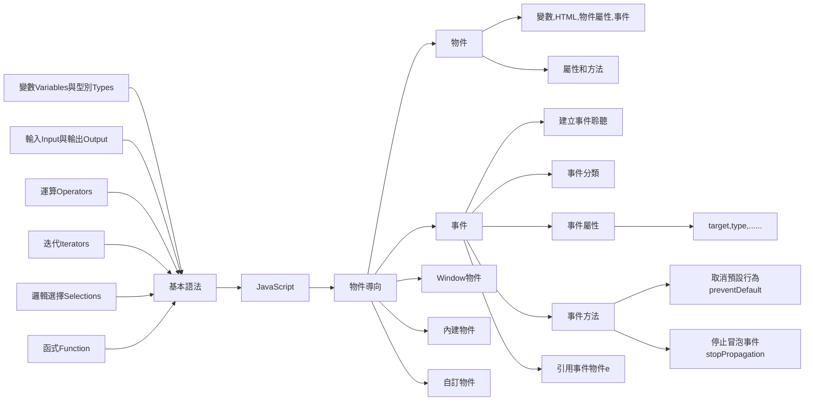

```mermaid
graph LR;  
 變數Variables與型別Types-->基本語法;  
 輸入Input與輸出Output-->基本語法;  
 運算Operators-->基本語法;  
 迭代Iterators-->基本語法;
 邏輯選擇Selections-->基本語法;
 函式Function-->基本語法;
 基本語法-->JavaScript;
 JavaScript-->物件導向;
 物件導向-->物件;
 物件導向-->事件;
 物件導向-->Window物件;
 物件導向-->內建物件;
 物件導向-->自訂物件;
 物件-->變數,HTML,物件屬性,事件;
 物件-->屬性和方法;
 事件-->建立事件聆聽;
 事件-->事件分類;
 事件-->事件屬性;
 事件-->事件方法;
 事件-->引用事件物件e;
 事件屬性-->target,type,......;
 事件方法-->取消預設行為preventDefault;
 事件方法-->停止冒泡事件stopPropagation;
```
