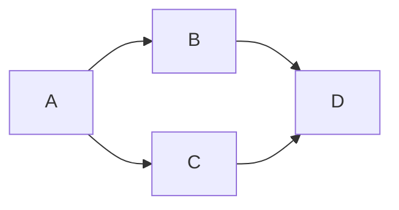

## 標題
用#字號建立標題，#的數量代表html的<h幾>
```md
## <h2>標題</h2>
```

## 引言
> 用大於>建立引言區塊
> >引言中可再加入引言
```md
> 用大於>建立引言區塊
> >引言中可再加入引言
```

## 清單
- 用-或+或\*建立無序清單
1. 數字點建立有序清單
- [ ] 後方加入\[空格]建立確認框
- [x] 空格改x為達成框
```md
- 用-或+或*建立無序清單
1. 數字點建立有序清單
- [ ] 後方加入[空格]建立確認框
- [x] 空格改x為達成框
```

## 分隔線
用三個或以上的星號、減號、底線來建立一個分隔線，行內不能有其他東西
*************
```md
*****************
```

## 連結
用中括號和小括號加入連結，可再用引號加入連結說明，[範例](https://markdown.tw/ "說明文字") 。
產生結果如同html的<a href="https://markdown.tw/" title="說明文字">範例</a>

或是使用[參考][ID]的形式，將所有連結放在段落後面，連結與主段落間要再空行
或是不使用連結ID，如[Google][]、[ID][]

[ID]: https://markdown.tw/  "說明文字"
[Google]: https://www.google.com.tw/
```md
用中括號和小括號加入連結，可再用引號加入連結說明，[範例](https://markdown.tw/ "說明文字")
產生結果如同html的<a href="https://markdown.tw/" title="說明文字">範例</a>

或是使用[參考][ID]的形式，將所有連結放在段落後面，連結與主段落間要再空行
或是不使用連結ID，如[Google][]、[ID][]

[ID]: https://markdown.tw/  "說明文字"
[Google]: https://www.google.com.tw/
```

## 強調
*用一個\*或\_夾住顯示斜體*
**用兩個\*或\_夾住顯示粗體**
```md
*用一個*或_夾住顯示斜體*<em></em>
**用兩個*或_夾住顯示粗體**<strong></strong>
```

## 標記
==用兩個等號=夾住顯示標記==
同html的`<mark>`
```md
==用兩個等號=夾住顯示標記==
```

## 取消特殊符號如\*或\_
在符號前加入反斜線\來還原

## 圖片
加入方式同一般連結，最前面加入驚嘆號!會自動顯示圖片

![圖片][]

[圖片]:https://markdown.tw/images/208x128.png "Markdown"
```markdown

![圖片][]

[圖片]:https://markdown.tw/images/208x128.png "Markdown"
```

## 程式碼
行內`程式碼直接用反引號`標起來標註
```md
行內`程式碼直接用反引號`標起來標註
```
```
程式碼區塊用三個反引號建立，可在上方反引號後標註何種語言
```
```md
`` `md
程式碼區塊用三個反引號建立，可在上方反引號後標註何種語言
` ``
```
    或是用tab或四個空格縮排
```md
    或是用tab或四個空格縮排
```

## 表格
用|與-畫出表格，第三列起中間不用|-|-|分隔

| thead 1  |   thrad 2   |  thread 3  |
| :------- |   :-----:   |  -------:  |
| 左冒號置左 |  兩側冒號置中 | 右冒號置右  |
| td       |    td       |       td   |

```md
| thead 1 | thrad 2 | thread 3 |
|---------|---------|----------|
| td      | td      | td       |
| td      | td      | td       |
```

中間-的數量隨意

|AAA|BBB|
|-|-|
|AAA|BBB|

```md
|AAA|BBB|
|-|-|
|AAA|BBB|
```

## 流程圖
流程圖使用[mermaid語法](https://mermaid-js.github.io/mermaid/#/)，簡易流程圖畫法如下:

同程式碼的三斜點包圍，語言標記為mermaid
第一列是繪圖種類，如一般流程圖是graph LR。最右邊是方向性縮寫，如LR是左到右，其他方向有上(T)下(B)左(L)右(R)
最後寫流程圖內容
graph LR
A-->B;  
A-->C;  
B-->D;  
C-->D;

## 數學公式
[參照](https://blog.maxkit.com.tw/2020/02/markdown.html)
