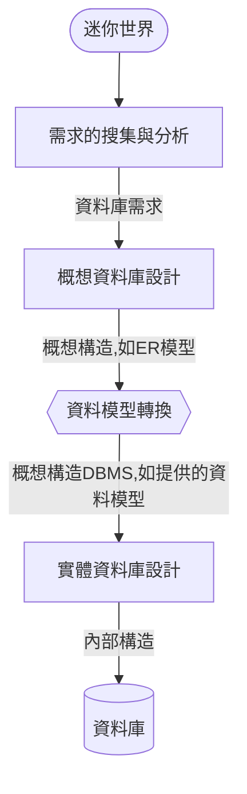

```mermaid
graph TB;
迷你世界([迷你世界]) --> 需求的搜集與分析;
需求的搜集與分析 -- 資料庫需求 --> 概想資料庫設計;
概想資料庫設計 -- 概想構造,如ER模型 --> 資料模型轉換{{資料模型轉換}};
資料模型轉換 -- 概想構造DBMS,如提供的資料模型 --> 實體資料庫設計;
實體資料庫設計 -- 內部構造 --> 資料庫[(資料庫)];
```

