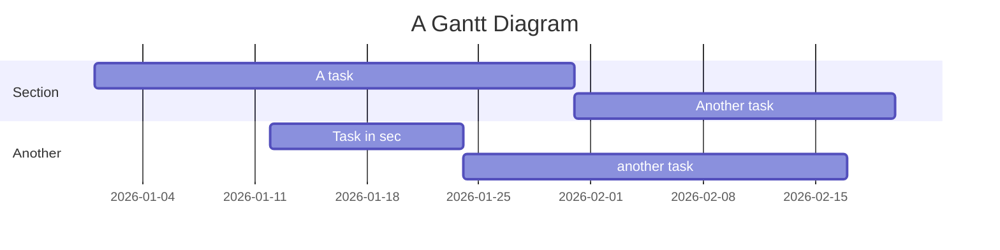

1/20  團隊建立
2/9  報告題目、緣起、目標使用者、功能架構(前台,後台,行動)(含動態互動展現及使用技術)、wireframe、參考網站

|時間|目標|
|----|----|
|1/20|團隊建立|
|2/9|報告題目、緣起、目標使用者、功能架構(前台,後台,行動)(含動態互動展現及使用技術)、wireframe、參考網站|
|2/15|檢查Use Case Diagram|
|2/16|<ul><li>專題介面進度檢查</li><ul><li>wireframe調整(桌機,手機),UI flow,動畫,UX調整</li></ul><li>提出網站設計風格(附實際網站)、LOGO設計(3個) (UI/UX課)</li></ul>|
|2/18|<li>檢查ERD (Class Diagram)</li><li>分工表</li>|
|2/22|<li>確認首頁風格版型、提出主要單元版型</li><li>互動設計檢查(UI/UX課)</li>|
|2/24|<li>檢查輸出入畫面</li><li>檢查資料庫表格建立</li>
|3/2|報告及期中驗收(系統上線)(含行動版)附A.期中驗收注意事項|
|3/4|就業輔導|
|3/7~3/11|各組進度檢視與問題解決|
|3/14~3/18|<ul><li>3/14前完成簡歷撰寫</li><li>各組進度檢視與問題解決</li><ul><li>3/16匯出資料庫</li><li>3/18 完成所有程式並整合</li></ul></ul>|
|3/22|確認程式整合, 正常運行|
|3/24|報告及總驗收 附B: 期末驗收 & 交專題海報,識別證檔|
|3/27|完成影片錄製 附C 專題成果展示|
|3/28|送出專題成果及履歷給廠商，繳交專題系統分析文件|
|3/30|線上面試|


```mermaid
gantt  
 dateFormat MM-DD
 axisFormat %m-%d
 title 官方時程
 
 section 第一次報告  
 團隊建立 : milestone, a1, 01-20  
 設定題目 : a2, after a1, 02-09
 報告題目 : milestone, 02-09
 檢查UCD : a3, after a2, 02-15
 介面進度檢查 : a4, after a3, 02-16
 檢查ERD、分工表 : a5, after a4, 02-18
 確認版型、互動設計 : a6, after a5, 02-22
 檢查輸出入畫面、資料庫表格 : a7, after a6, 02-24
 期中驗收 : a8, after a7, 03-02
 
 section 第二次報告
 就業輔導 : milestone, 03-04
 各組進度檢視 : b2, 03-07, 03-11
 簡歷撰寫 : b3, after a8, 03-14
 匯出資料庫 : b4, after a8, 03-16
 整合所有程式 : b5, after a8, 03-18
 確認正常運行 : b6, after b5, 03-22
 第二次報告 : milestone, 03-24
 影片錄製 : milestone, 03-27
 交付廠商 : milestone, 03-28
 線上面試 : milestone, 03-30
 
```




