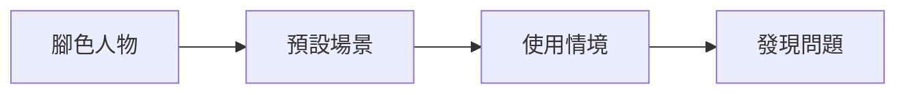

# Persona
將目標客群凝聚塑造成一個具體的人物，並圍繞這個人物作產品開發，以增加同理心。
也可使用虛擬人物來進行壓力測試。

## 痛點
需求，在意的地方。

## 使用者故事
- 從人物誌的角度講述一個句子的故事
> 做為__Who__，我要__What__，才能__Why__
> 某類型的使用者，採取的行動，結果、好處
- 優先設計目標
- 增加團隊向心力
- 以使用者為中心

## 使用者旅程

## 劇本法設計
同時設定腳色、場景、使用情境為背景，以此背景推演問題

