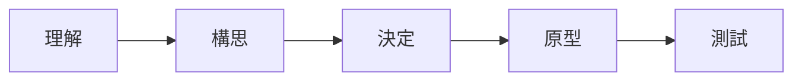

# Design Sprint
- 五天解決問題
- 將專案切割成每日的小目標
- 時間限制內，快速設計，有效完成
- 團隊合作，跨部門、跨地域較適合
- 主持人最好有整體的認識

## 優點
- 節省時間
- 創造有效途徑
- 使用者為中心
- 多功能調度
- 發布前測試

## 階段

- 理解，確定大家都知道問題點
- 構思，設想可能的解決方案，腦力激盪法
- 決定，最符合可行性的方案
- 原型，第一個版本的設計
- 測試

## 回顧會議
- 針對團隊設計的協作評估
- 每位參與設計衝刺的人給出回饋的意見

