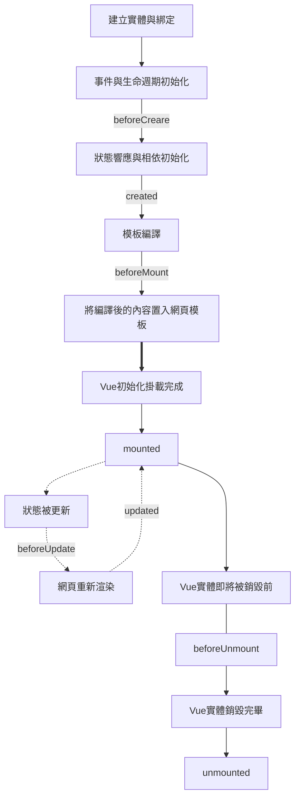

# 生命週期



| Options API                         | Composition API | 說明                                                                       |
| ----------------------------------- | --------------- | -------------------------------------------------------------------------- |
| beforeCreate                        | setup()         | Vue 實體被建立，狀態與事件尚未初始化                                       |
| created                             | setup()         | 狀態與事件已初始化，prop、data、[[computed]] 等屬性已建立，vm.$el 屬性無法使用 |
| beforeMount                         | onBeforeMount   | Vue 實體尚未與模板綁定                                                     |
| mounted                             | onMounted       | Vue 實體掛載完成，el 的目標 DOM 被$el 替換                                 |
| beforeUpdate                        | onBeforeUpdate  | 狀態被變動時，畫面同步更新前                                               |
| updated                             | onUpdated       | 狀態被變動時，畫面更新完成                                                 |
| beforeDestroy(2) / beforeUnmount(3) | onBeforeUnmount | Vue 實體物件被銷毀前                                                       |
| destroyed(2) / unmounted(3)         | onUnmounted     | Vue 實體物件被銷毀完畢                                                     |
| errorCaptured                       | onErrorCaptured | 子孫元件的錯誤被捕獲時觸發                                                 |
| activated                           |                 | Vue 元件被啟動時觸發，搭配 keep-alive 使用                                 |
| deactivated                         |                 | Vue 元件被解除時觸發，搭配 keep-alive 使用                                 |

## unmount 卸載元件

若在 Vue.createApp 時直接 .mount ，則無法透過 vm.unmount() 來卸載元件
```js
const vm = Vue.createApp({
}).mount("#app");

vm.unmount();
// Error: "vm.unmount is not a function"
```

須改為以下
```js
const vm = Vue.createApp({
})

vm.mount("#app");

vm.unmount();
```

