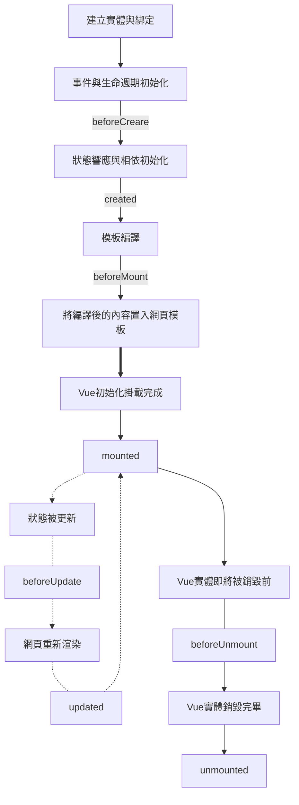

# 生命週期

```mermaid
flowchart TB
  建立實體與綁定 --> 事件與生命週期初始化
  事件與生命週期初始化 -- beforeCreare --> 狀態響應與相依初始化
  狀態響應與相依初始化 -- created --> 模板編譯
  模板編譯 -- beforeMount --> 將編譯後的內容置入網頁模板 ==> Vue初始化掛載完成 --> mounted
  mounted -.-> 狀態被更新 -.- beforeUpdate -.-> 網頁重新渲染 -.- updated -.-> mounted
  mounted ---> Vue實體即將被銷毀前 --- beforeUnmount --> Vue實體銷毀完畢 --> unmounted
```

