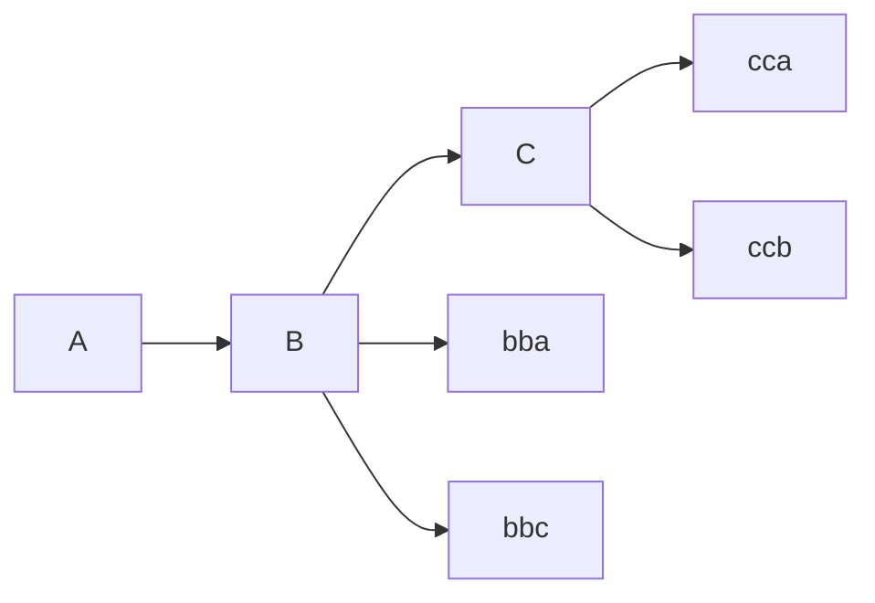
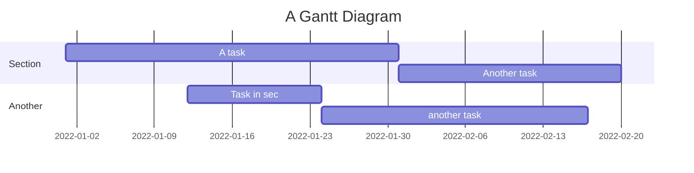
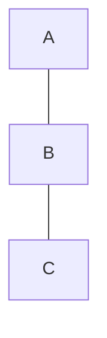

```css
.box
.box
```


==aaa==

<style>
pre {
height:100px;
background:#cac;
}
</style>


<pre><code>This is a code block.
</code></pre>


```{css, echo=FALSE}
pre {
  height: 300px;
  overflow-y: auto;
}

pre[class] {
  max-height: 100px;
}
```
```{r}
# pretend that we have a lot of code in this chunk
if (1 + 1 == 2) {
  # of course that is true
  print(mtcars)
  # we just printed a lengthy data set
}
```

```{css, echo=FALSE}
.scroll-100 {
  max-height: 100px;
  overflow-y: auto;
  background-color: inherit;
}
```

``` {style="height: 100px;"}
print(mtcars)
```




